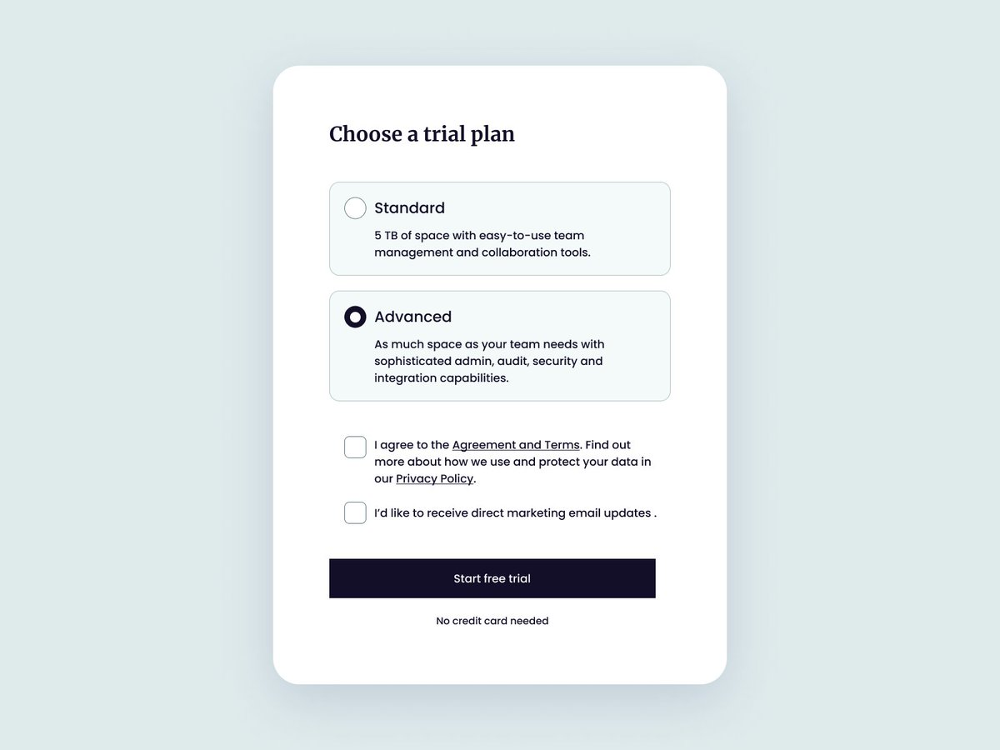

<h1 align="center">UI Form</h1>

Projeto de um formulário interativo proposto por Florin Pop no desafio <a href="https://twitter.com/florinpop1705/status/1599061607442571265">#codingchallenge</a>🧑‍💻

  <a href="#-tecnologias">Tecnologias</a>&nbsp;&nbsp;&nbsp;|&nbsp;&nbsp;&nbsp;
  <a href="#-projeto">Projeto</a>&nbsp;&nbsp;&nbsp;|&nbsp;&nbsp;&nbsp;
  <a href="#-licença">Licença</a>&nbsp;&nbsp;&nbsp;|&nbsp;&nbsp;&nbsp;
  <a href="#-contato">Contato</a>

  

    

## 🚀 Tecnologias

Esse projeto foi desenvolvido com as seguintes tecnologias:

- HTML e CSS
- Git e Github
- Figma

## 💻 Projeto

Projeto de um UI form utilizando apenas HTML e CSS proposto por Florin Pop no desafio [#codingchallenge](https://twitter.com/florinpop1705/status/1599061607442571265) 🚀  
Você pode acessar o projeto online [CLICANDO AQUI!](https://thiagonevesalmeida.github.io/ui-form/)

## 📝 Licença

Esse projeto está sob a licença MIT.

## 📨 Contato

thiagonevesdealmeida@gmail.com

[linkedin.com/in/thiagonevesdealmeida](https://www.linkedin.com/in/thiagonevesdealmeida/) 